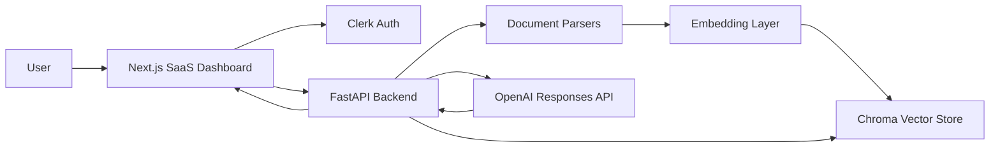
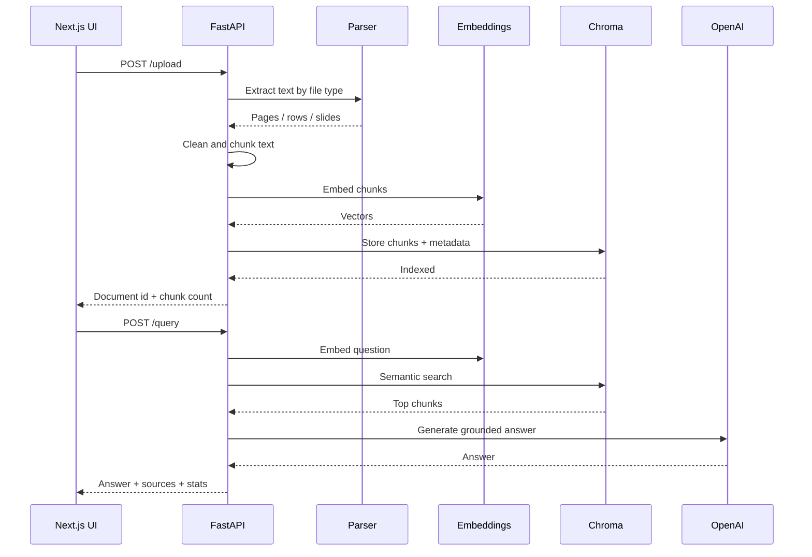

# RAG SaaS

An OpenAI-powered document intelligence SaaS starter that lets users upload private documents, index them into a vector knowledge base, and chat with source-cited answers.

This repository is built as a complete local product workspace: a Next.js dashboard for users and a FastAPI backend for ingestion, retrieval, and answer generation.

## What This App Does

RAG SaaS turns company files into a searchable AI knowledge base.

Users can:

- Upload documents into their own workspace.
- Index supported files into Chroma vector collections.
- Ask natural-language questions about uploaded content.
- Receive answers grounded in retrieved source chunks.
- Inspect citations and source snippets for each answer.
- See backend, OpenAI, embedding, document, and chunk status in the UI.

The app uses OpenAI automatically when `OPENAI_API_KEY` is configured. Without a key, it still runs locally with sentence-transformer embeddings and retrieval-only fallback answers, so development never blocks on credentials.

## Product Snapshot

| Area | Status |
| --- | --- |
| Auth shell | Clerk-powered sign-in/sign-up UI |
| Document upload | Drag-and-drop plus upload queue |
| File parsing | PDF, DOCX, TXT, MD, CSV, JSON, XLSX, PPTX |
| Embeddings | OpenAI `text-embedding-3-small` with local fallback |
| Vector store | Persistent Chroma collections |
| Chat | OpenAI Responses API with source-cited RAG prompts |
| Fallback mode | Retrieval excerpts when OpenAI is not configured |
| Dashboard | Health, stats, documents, uploads, chat, readiness |

## Architecture



### Backend Flow



## Repository Structure

```text
ragsaas/
  backend/
    main.py                 FastAPI app and API routes
    requirements.txt        Python dependencies
    rag/
      chunker.py            Text cleanup and chunking
      embeddings.py         OpenAI/local embedding provider
      parser.py             PDF/DOCX/TXT/CSV/JSON/XLSX/PPTX parsing
      pipeline.py           Full ingestion pipeline
      vector_store.py       Chroma storage, search, stats
    uploads/                Local uploaded files
    chroma/                 Local Chroma database

  frontend/
    app/
      page.tsx              SaaS dashboard and chat workspace
      layout.tsx            App shell and providers
      components/navbar.tsx Navigation and auth controls
      globals.css           Global Tailwind styling
    package.json            Next.js scripts and dependencies
    proxy.ts                Clerk middleware
```

## Tech Stack

### Frontend

- Next.js 16
- React 19
- Tailwind CSS
- Material UI icons/components
- Framer Motion
- Clerk authentication

### Backend

- FastAPI
- Pydantic
- ChromaDB
- OpenAI Python SDK
- PyMuPDF, python-docx, python-pptx, openpyxl
- Sentence Transformers local fallback

### OpenAI

- Responses API for grounded answer generation
- Embeddings API with `text-embedding-3-small`
- Configurable chat and embedding model names

## Quickstart

### 1. Clone and Enter the Repo

```bash
git clone <your-repo-url> ragsaas
cd ragsaas
```

If you already have the project locally, just `cd` into the repository root.

### 2. Configure the Backend

Create `backend/.env`:

```bash
cp backend/.env.example backend/.env
```

Then edit it:

```env
OPENAI_API_KEY=sk-your-openai-api-key
OPENAI_CHAT_MODEL=gpt-5.6
OPENAI_EMBEDDING_MODEL=text-embedding-3-small
```

`OPENAI_API_KEY` is optional for local testing, but required for OpenAI-generated answers.

### 3. Install and Run the Backend

```bash
cd backend
python3 -m venv .venv
source .venv/bin/activate
pip install -r requirements.txt
uvicorn main:app --reload --host 127.0.0.1 --port 8000
```

Verify:

```bash
curl http://127.0.0.1:8000/health
```

Expected shape:

```json
{
  "status": "ok",
  "openai_configured": true,
  "embedding_provider": "openai",
  "embedding_model": "text-embedding-3-small",
  "chat_model": "gpt-5.6"
}
```

### 4. Configure the Frontend

Create `frontend/.env`:

```bash
cp frontend/.env.example frontend/.env
```

Set:

```env
NEXT_PUBLIC_API_URL=http://localhost:8000
NEXT_PUBLIC_CLERK_PUBLISHABLE_KEY=pk_test_your-clerk-key
CLERK_SECRET_KEY=sk_test_your-clerk-secret
NEXT_PUBLIC_CLERK_SIGN_IN_URL=/sign-in
NEXT_PUBLIC_CLERK_SIGN_IN_FALLBACK_REDIRECT_URL=/
NEXT_PUBLIC_CLERK_SIGN_UP_FALLBACK_REDIRECT_URL=/
```

### 5. Install and Run the Frontend

```bash
cd frontend
npm install
npm run dev
```

Open:

```text
http://localhost:3000
```

## Daily Development Commands

### Backend

```bash
cd backend
source .venv/bin/activate
uvicorn main:app --reload --host 127.0.0.1 --port 8000
```

Compile check:

```bash
cd backend
.venv/bin/python -m py_compile main.py rag/*.py
```

### Frontend

```bash
cd frontend
npm run dev
```

Quality checks:

```bash
cd frontend
npm run lint
npm run build
```

## API Reference

Base URL:

```text
http://localhost:8000
```

### `GET /health`

Returns backend, OpenAI, embedding, chat model, and supported file status.

```bash
curl http://127.0.0.1:8000/health
```

### `POST /upload`

Uploads and indexes a document.

```bash
curl -X POST http://127.0.0.1:8000/upload \
  -F "user_id=demo_workspace" \
  -F "file=@/path/to/document.pdf"
```

Response:

```json
{
  "success": true,
  "user_id": "demo_workspace",
  "filename": "document.pdf",
  "stored_as": "document.pdf",
  "rag": {
    "document_id": "uuid",
    "filename": "document.pdf",
    "chunks": 12
  }
}
```

### `GET /documents`

Lists indexed documents for a user.

```bash
curl "http://127.0.0.1:8000/documents?user_id=demo_workspace"
```

### `POST /query`

Asks a question over the user's indexed documents.

```bash
curl -X POST http://127.0.0.1:8000/query \
  -H "Content-Type: application/json" \
  -d '{
    "user_id": "demo_workspace",
    "question": "What is our refund window?",
    "limit": 5
  }'
```

Response:

```json
{
  "success": true,
  "question": "What is our refund window?",
  "answer": "The refund window is 30 days [1].",
  "mode": "openai_responses",
  "model": "gpt-5.6",
  "sources": [
    {
      "index": 1,
      "filename": "company-policy.txt",
      "page": 0,
      "text": "Acme refunds are available within 30 days."
    }
  ]
}
```

## Supported File Types

| Type | Parser |
| --- | --- |
| `.pdf` | PyMuPDF |
| `.docx` | python-docx |
| `.txt` | Plain text reader |
| `.md` | Plain text reader |
| `.csv` | CSV row formatter |
| `.json` | JSON pretty-printer |
| `.xlsx` | openpyxl |
| `.pptx` | python-pptx |

Unsupported file types return a structured `400` response.

## How Retrieval Works

1. The backend receives an upload.
2. The parser extracts text page-by-page, sheet-by-sheet, slide-by-slide, or row-by-row.
3. The chunker cleans text and splits it into overlapping chunks.
4. The embedding layer creates vectors with OpenAI or local sentence transformers.
5. Chroma stores chunks with metadata:
   - `user_id`
   - `document_id`
   - `filename`
   - `page`
   - `chunk_index`
6. A query is embedded using the same provider/model.
7. Chroma retrieves the most similar chunks.
8. OpenAI generates an answer using only those retrieved excerpts.
9. The frontend renders the answer and source cards.

## User Isolation

Each user gets a separate Chroma collection based on:

```text
user id + embedding provider + embedding model
```

That matters because local embeddings and OpenAI embeddings have different vector dimensions. Keeping collections separated prevents dimension mismatch errors when switching providers.

## OpenAI Behavior

### With `OPENAI_API_KEY`

The app uses:

- OpenAI embeddings for document chunks and queries.
- OpenAI Responses API for final answers.
- Source-grounded instructions that require citations.

### Without `OPENAI_API_KEY`

The app still runs:

- Local sentence-transformer embeddings.
- Chroma semantic search.
- Retrieval fallback answers with top source excerpts.

This makes onboarding and demos much easier: the product works before secrets are configured, then becomes fully OpenAI-powered when credentials are added.

## Environment Variables

### Backend

| Variable | Required | Default | Description |
| --- | --- | --- | --- |
| `OPENAI_API_KEY` | No | None | Enables OpenAI embeddings and answers |
| `OPENAI_CHAT_MODEL` | No | `gpt-5.6` | Model used by the Responses API |
| `OPENAI_EMBEDDING_MODEL` | No | `text-embedding-3-small` | Model used by the Embeddings API |

### Frontend

| Variable | Required | Default | Description |
| --- | --- | --- | --- |
| `NEXT_PUBLIC_API_URL` | No | `http://localhost:8000` | FastAPI backend URL |
| `NEXT_PUBLIC_CLERK_PUBLISHABLE_KEY` | Yes for auth | None | Clerk browser key |
| `CLERK_SECRET_KEY` | Yes for auth | None | Clerk server secret |
| `NEXT_PUBLIC_CLERK_SIGN_IN_URL` | No | `/sign-in` | Sign-in route |

## Production Notes

This app is local-first and ready to evolve into a deployed SaaS. Before production, add:

- Server-side auth checks that validate Clerk identity on backend requests.
- Durable object storage for uploads, such as S3, GCS, or R2.
- Managed vector database or persistent Chroma volume backups.
- Background jobs for large-file ingestion.
- File size limits and upload scanning.
- Rate limiting per user/workspace.
- Billing and plan limits.
- Observability for ingestion failures and model latency.
- Automated tests for parsers, ingestion, retrieval, and API contracts.

## Security Checklist

- Do not commit real `.env` files.
- Keep `OPENAI_API_KEY` server-side only.
- Validate authenticated user IDs on the backend before trusting requests.
- Restrict CORS origins in deployed environments.
- Sanitize filenames before saving uploads.
- Limit upload size and supported file types.
- Consider deleting original uploads after indexing if your use case allows it.

## Troubleshooting

### Frontend says backend is offline

Check the backend:

```bash
curl http://127.0.0.1:8000/health
```

If it fails, start FastAPI:

```bash
cd backend
source .venv/bin/activate
uvicorn main:app --reload --host 127.0.0.1 --port 8000
```

### OpenAI says "Needs API key"

Create `backend/.env` and set:

```env
OPENAI_API_KEY=sk-your-openai-api-key
```

Restart the backend after changing env vars.

### Upload works but chat has fallback answers

That means retrieval is working, but OpenAI answer generation is not configured or failed. Check:

- `OPENAI_API_KEY`
- `OPENAI_CHAT_MODEL`
- Backend terminal logs
- `/health` response

### Chroma dimension errors

This app separates collections by embedding provider and model. If you manually changed collection code or old data is causing issues, stop the backend and inspect:

```text
backend/chroma/
```

For local development only, you can clear Chroma data if you do not need existing indexes.

### PPTX or XLSX parsing errors

Reinstall backend dependencies:

```bash
cd backend
source .venv/bin/activate
pip install -r requirements.txt
```

## Roadmap

High-impact next steps:

- Backend Clerk JWT verification.
- Organization/workspace model.
- Document deletion and re-indexing.
- Streaming chat responses.
- Conversation history.
- Usage metering.
- Stripe billing.
- Admin dashboard.
- Background ingestion worker.
- Deployment manifests.
- Evaluation suite for answer quality.

## Design Principles

This project follows a few practical product principles:

- The app should work before every integration is perfect.
- Errors should be visible and useful.
- Retrieval should be inspectable through citations.
- User data should be isolated by default.
- OpenAI should upgrade the experience, not block local development.

## License

Add your preferred license before publishing this repository.
